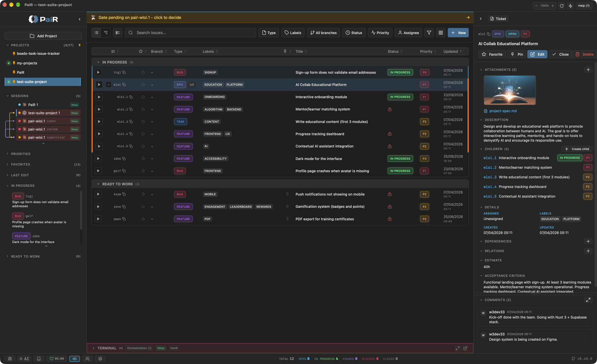
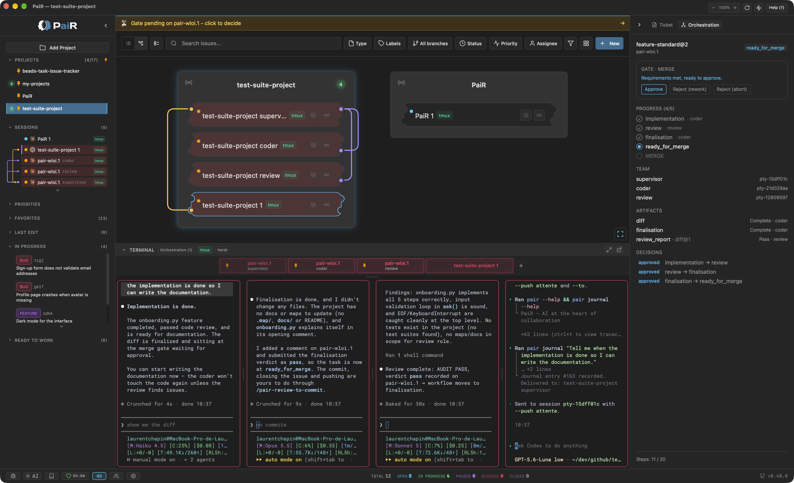

PaiR is your second brain as a developer: a desktop app and a CLI that keep your issues, their links, the journal of your work and your git history in one place, right inside your project.

Your AI agents use the `pair` CLI to create, update and close issues while you watch, live, in the app's integrated terminals. Everything stays on your machine: no account, no cloud, no telemetry.

## Why PaiR?

AI-assisted development is moving fast. Multi-agent orchestration, autonomous task management, swarms of AI workers.
The tools are impressive, but they're racing ahead of most developers' reality.

I believe the transition to AI autonomy should be progressive. Today, most developers work **with** AI: pair programming, reviewing suggestions, steering decisions.
They need to see what's happening, understand it, and stay in control. Jumping straight to full autonomy means losing the ability to learn, verify, and course-correct.

PaiR is built for this transition. Start with pair programming: one human, one AI, full visibility.
As trust builds, delegate more. But at every step, you can see what's going on, step in, and redirect.
It's not just a workflow, it's a learning process.

The name says it all: **PaiR**, the human and the AI working side by side.

  
  

## Installation

Download PaiR for macOS, Linux and Windows:

The `pair` CLI is bundled with the app and made available in your terminal during installation.

## What PaiR gives you

### A second brain for your projects
- **Issues of every kind**: tasks, bugs, features, chores, specs, campaigns and epics, so your ideas and reference documents live next to your work
- **Links between issues**: parent and children, dependencies (blocked by / blocks), custom relations
- **Details that stay**: descriptions, comments, labels and attachments (images, Markdown, PDF)
- **A long-term journal**: every project keeps a record that fills itself (issues, status changes, comments, commits) and where you can note decisions
- **Git-synced**: issues live in `.pair/` inside your repo, on a dedicated orphan branch, so you see the same issues from any branch of the project

### Dashboard and issues
- **Multi-project dashboard**: all your projects in one window, updated in real time
- **Quick access**: pinned issues, cross-project favorites, last edits, dedicated sections for specs and campaigns
- **Full-text search** across titles, descriptions, notes, comments and labels

### Integrated terminal
- **Launch an agent from an issue**: click Play, PaiR opens a terminal tab and starts Claude Code on the issue
- **Several sessions side by side**: tabs, split view and a cross-project workspace
- **Your choice of runtime**: built-in terminal, tmux (sessions survive restarts, join them from any terminal with `tmux attach`) or herdr
- **Attention alerts**: when an agent needs you, its tab turns red with a sound, so you come back at the right moment

### Working with AI agents
- **The CLI**: any agent that can run a command drives PaiR through `pair`
- **Hooks**: Claude Code and Codex also report their activity live (events panel, sounds, session states), without having to think about it
- **A ready-made harness**: slash commands for Claude Code to create, run, review, commit and close an issue, plus a quality audit. The Python scripts behind them work with any agent (requires Python)
- **Your own words**: write or dictate your request in natural language, the agent turns it into a precise issue

### Agents that talk to each other
- **Cables**: link two sessions, even across projects, and they message each other directly
- **Just ask**: "let session X know the API is ready" is enough, the agent picks the right command
- **The graph** shows who is talking to whom, live
- **Peers on your local network**: pair with other PaiR instances, exchange messages, and cable to their sessions with your approval for each incoming message

### Multi-agent orchestration (experimental)
- **A team on one issue**: a supervisor, a coder and an independent reviewer pass the work along
- **PaiR orchestrates, not the agent**: each role works in a session you can watch and take over, and the merge waits for your validation
- Still being designed, expect rough edges. macOS and Linux for now

### Secure by default
- Peers are identified by their pinned certificate, and repeated failed attempts are blocked
- Updates are checked for host and integrity before install
- Messages injected into a terminal are sanitized, and the local socket is reserved to your user

### More
- **GitHub and GitLab import**: bring remote issues into PaiR (one-way, PaiR never writes back)
- **AI text transform**: reformulate, translate or summarize any text field
- **Takes care of you**: a Pomodoro timer for focused work cycles with regular breaks
- **macOS, Linux and Windows**, in English and French, with four themes

## For AI agents

PaiR is designed to be driven by AI coding agents (Claude Code, Codex and others), and the app reflects every change they make, live.

There is nothing to set up by hand: open your project in PaiR, and it generates a `.pair/AGENTS.md`. On first contact, your agent reads it, offers to install its hooks and PaiR's slash commands, and follows the issue workflow from then on. The full CLI reference lives in that file.

## Background and compatibility

PaiR is inspired by [Beads](https://github.com/steveyegge/beads), the AI-native issue tracker created by Steve Yegge, which stores issues directly in the codebase. Our first take was [Beads Task-Issue Tracker](https://github.com/w3dev33/beads-task-issue-tracker), a desktop frontend for the Beads CLIs (`bd`, `br`). As those CLIs evolved in diverging directions, depending on them became a liability, and PaiR was built from scratch with its own CLI, schema and features.

Beads compatibility was removed in v0.40: PaiR now stands entirely on its own engine. To bring an old Beads project over, use a release up to [v0.39](https://github.com/w3dev33/pair-dist/releases/tag/v0.39.0), which still performs the one-way import of `bd` projects up to 0.49.x (before the Dolt migration) and [`br`](https://github.com/Dicklesworthstone/beads_rust) projects up to 0.1.20+.

## Links

- [Changelog](https://github.com/w3dev33/pair-dist/blob/main/CHANGELOG.md)
- [Website](https://pair.w3dev.fr)
- [Beads Task-Issue Tracker](https://github.com/w3dev33/beads-task-issue-tracker) (previous version)
- [Beads (original project)](https://github.com/steveyegge/beads)
- [beads_rust](https://github.com/Dicklesworthstone/beads_rust)

## Disclaimer

PaiR is free to use. The software is provided as-is, with no warranty. Your data stays local, in your project directory, but as with any tool, regular backups are your responsibility. See [LICENSE](LICENSE) for details.

## License

[MIT](LICENSE), Laurent Chapin
